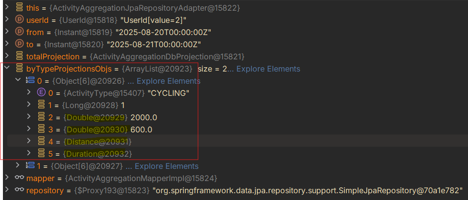

# Use custom value types Distance and Duration

## Context and Problem Statement

In the domain model we handle quantities for time and length frequently. Primitives like `long` and `double` 
were used to store these values, which introduces risks:

* Lack of unit clarity (e.g., is a duration in seconds, milliseconds, or minutes? Is a distance in meters or kilometers?)
* Accidental misuse or mixing of units is easy
* Code becomes harder to understand and maintain

Additionally, the JPA aggregation queries for activity statistics combine multiple aggregates such as `SUM` and `MAX`. 
Different Java types are returned for these functions:

* `SUM` in our case returns `Double`, `BigDecimal`, `Long` or `BigInteger` 
* `MAX` over a custom-mapped attribute (`Distance` and `Duration`) is mapped back into the custom type

This leads to awkward projection constructors with mixed argument types (e.g., `Double` or `Long` for `SUM` results 
and `Distance` or `Duration` for `MAX` results):

## Considered Options

* Keep using primitives (`Long` and `Double`) and document units
* Use custom types in the domain but allow mixed constructor argument types in projections (some primitives, some custom types)
* Introduce custom types and normalize all numeric aggregates returned by JPA to a common primitive (`Double`, `Long`) in 
  custom queries/projections, and then convert to domain types in the projection constructors

## Decision Outcome

Chosen option: "Introduce custom types and normalize all numeric aggregates returned by JPA to a common primitive (e.g. 
`Double` or `Long`) in custom queries/projections, and then convert to domain types in the projection constructors", because:

* Custom value objects (`Distance`, `Duration`) provide compile-time safety and encode the unit semantics, preventing unit mix-ups
* Converters (`DistanceConverter`, `DurationConverter`) ensure minimal friction with JPA for entity persistence
* For aggregation queries, forcing `SUM` and `MAX` to return `Double`/`Long` in the projection makes constructor signatures 
  consistent and avoids mixed-type constructors

### Consequences

* Good, because:
  - The domain layer communicates explicit units through `Distance` and `Duration`, increasing readability and correctness
  - Fewer unit-related bugs: conversions are centralized
  - JPA projection classes (e.g. `ActivityAggregationDbProjection`, `ActivityTypeAggregationDbProjection`) have simple, 
    consistent constructor signatures (e.g., using `Double`/`Long` for numeric aggregates), which reduces ambiguity and surprises 
* Bad, because:
  - There is a small loss of static type information in the projection layer (temporarily using `Double`)
  - Potential precision concerns with `Double` vs `BigDecimal`. If financial-grade precision is needed in the future, 
    we may revisit to standardize on `BigDecimal` instead.

### Notes on Implementation

* Entities: `ActivityDbEntity` persists `Distance` and `Duration` via `DistanceConverter` and `DurationConverter`
* Aggregations: The repository `ActivityAggregationProjectionRepository` defines custom queries whose projections 
  (`ActivityAggregationDbProjection`, `ActivityTypeAggregationDbProjection`) expose aggregated numeric results as `Double`
  and `Long`. Even where `MAX` could be mapped back to `Distance` or `Duration`, we cast to `Double` or `Long` for 
  consistency with `SUM` to avoid projection constructors with mixed argument types.

Decision date: 2025-08-29
