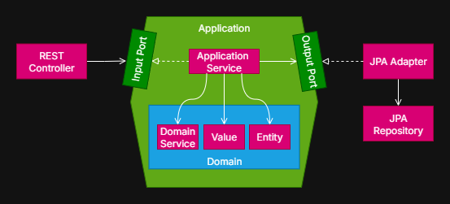

# Architecture
## Ports and Adapters
This application uses the Ports and Adapters (a.k.a. Hexagonal) architecture. The core business logic (domain and 
application) is isolated behind interfaces (ports). Technology-specific details (HTTP, databases, etc.) live in adapters 
that "plug" into those ports. This keeps the domain independent of I/O concerns and makes the system easier to test and 
evolve.



### Concepts in this codebase
* Domain (pure business)
  * Entities, value objects, and domain services express the core model and rules
* Application (use cases)
  * Coordinates workflows and orchestrates ports
  * Defines ports as Java interfaces
  * Defines events and event listeners
* Ports
  * Incoming ports model what the application can do (use cases) from an external perspective, controllers call these
  * Outgoing ports model what the application needs from the outside world (e.g. load/save activities),
    adapters implement these to talk to infrastructure like databases
* Adapters
  * Inbound adapters call the application through incoming ports (e.g. REST controllers map Request DTOs to domain 
    objects, invoke application services, and map domain objects back to Response DTOs)
  * Outbound adapters implement outgoing ports to talk to external systems (e.g. JPA repositories) and maps between 
    domain objects and external representations (e.g. database entities)
* Infrastructure
  * Cross-cutting technical concerns (e.g. config, security) and Spring wiring

### Folder Structure

```plain
/src/main/.../fitnesstrackerapi
├-- adapter
|   ├-- in
|   |   └-- rest
|   |       ├-- controller
|   |       ├-- dto
|   |       ├-- mapper
|   |       └-- validation
|   └-- out
|       └-- jpa
|           ├-- converter
|           ├-- entity
|           ├-- mapper
|           ├-- projection
|           └-- repository
├--- application
|    ├-- event
|    ├-- eventlistener
|    ├-- exception
|    ├-- port
|    |   ├-- in
|    |   └-- out
|    └-- service
├--- domain
|    ├-- entity
|    ├-- enums
|    ├-- service
|    └-- value
└--- infrastructure
     ├-- config
     ├-- openapi
     ├-- ratelimiting
     ├-- security
     └-- supportive
```

### Why this helps
* Testability: one can unit-test the domain and application services by mocking ports, without a database or web server.
* Replaceability: swap adapters without changing the core (e.g. replace JPA with another store, add CLI next to REST).
* Maintainability: clear boundaries reduce coupling and make refactoring safer.


## Further Evolution
Instead of having one hexagon, split into multiple hexagons, one per domain:
* Activity
* Gamification (e.g. challenges, milestones, trophies)
* Notification
* User
